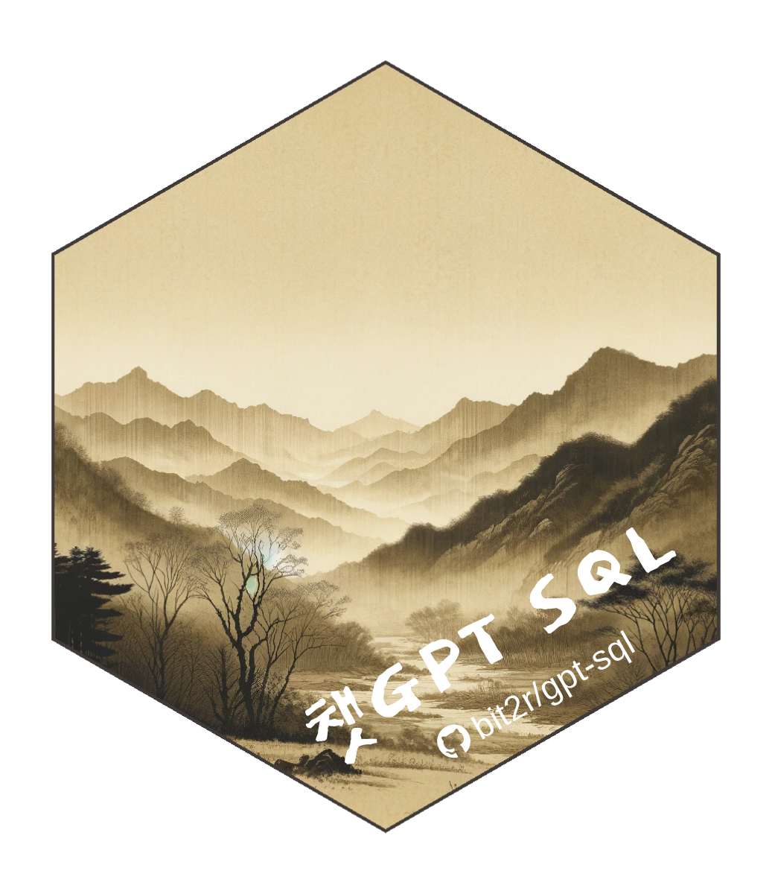

# 챗GPT SQL 

챗GPT SQL은 소프트웨어 카펜트리 [데이터베이스와 SQL](https://swcarpentry.github.io/sql-novice-survey/)을 한국어로 2015년 처음으로 번역한 것을 근간으로 인공지능과 데이터 과학 추세에 맞춰 관련 사항을 추가하고 수정했습니다. 

챗GPT로 상징되는 인공지능 기술을 최대한 담아내려고 하였으며, 
실무에서 많이 사용되는 다양한 오픈소스 데이터베이스(SQLite3, DuckDB, PostgreSQL)와 
OpenAI 상용 API는 물론 오픈소스 LLM (Large Language Model)을 활용하여 SQL 쿼리를 
금전적인 제약없이 무료로 작성하는 방법도 제시하였습니다.

데이터베이스와 SQL을 처음 접하는 사람들이 쉽게 이해할 수 있도록 
스프레드시트(엑셀)을 추가하여 더 크고 복잡한 데이터를 다루는 방법을 설명했으며
ETL 과정을 통해 외부에서 데이터를 가져오고, 데이터베이스에 저장하고, SQL 쿼리로 이어지는
일련의 과정을 단계별로 자세하게 설명을 추가했습니다.

데이터베이스와 SQL이 실무에서 유용하게 사용될 수 있도록 
PostgreSQL에 포함되어 있는 내장 데이터베이스(DVD 대여)를 통해 
실무에서 접하는 난이도 높은 문제를 증거기반으로 풀 수 있는 사례도 추가하여 챗GPT 인공지능으로 넘어가는 가교로 역할을 할 수 있도록 제작을 하였습니다.

# 쿼토

전자책은 쿼토 책(Quarto Book)을 활용하여 제작되었으며
PDF 파일은 한글 글꼴 및 한글 책 특성을 반영하기 위해서 
공익법인 한국 R 사용자회에서 제작한 [`bitPublish`](https://github.com/bit2r/bitPublish)를 템플리트로 사용하여 
챗GPT SQL 한글 책을 조판했습니다.

